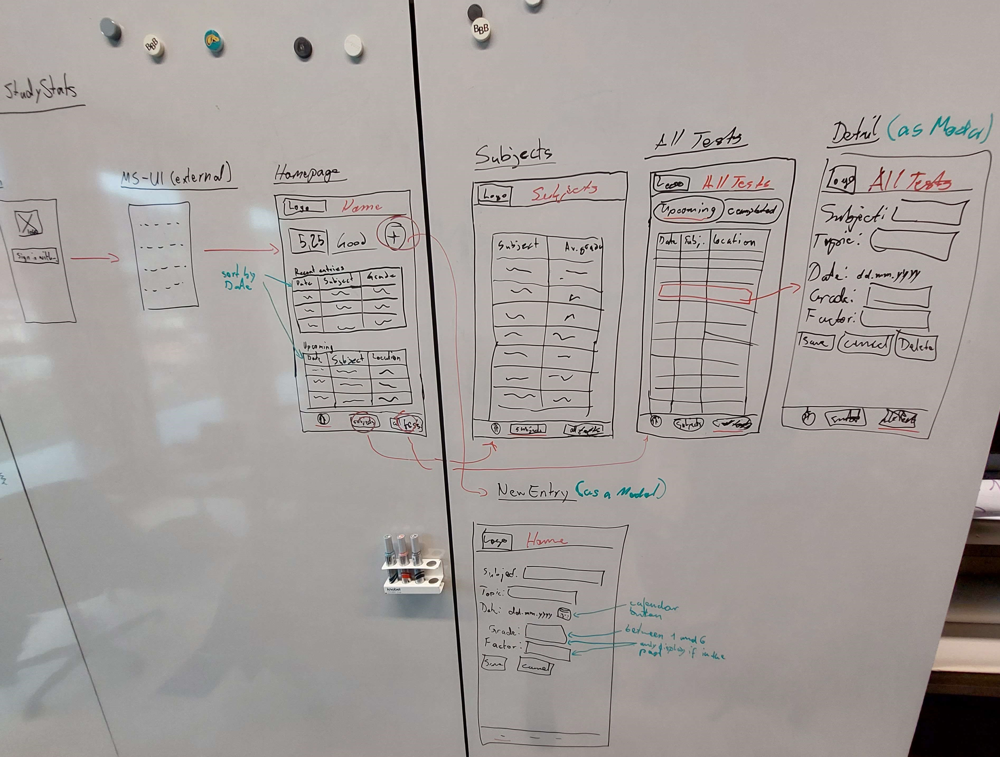
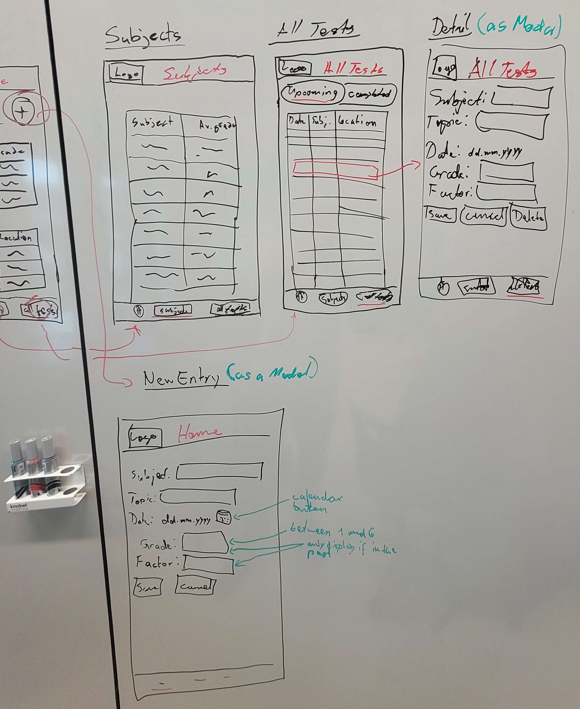
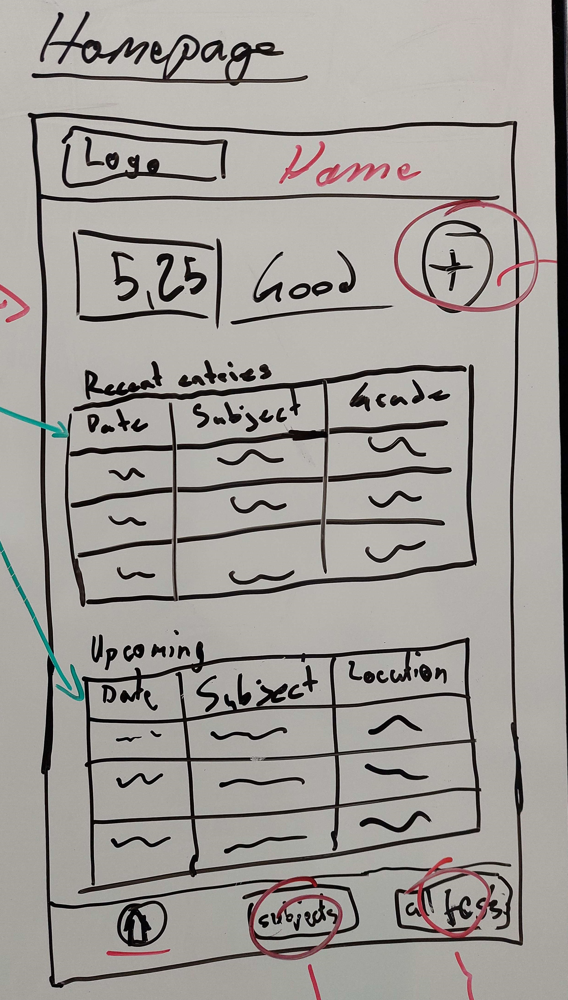
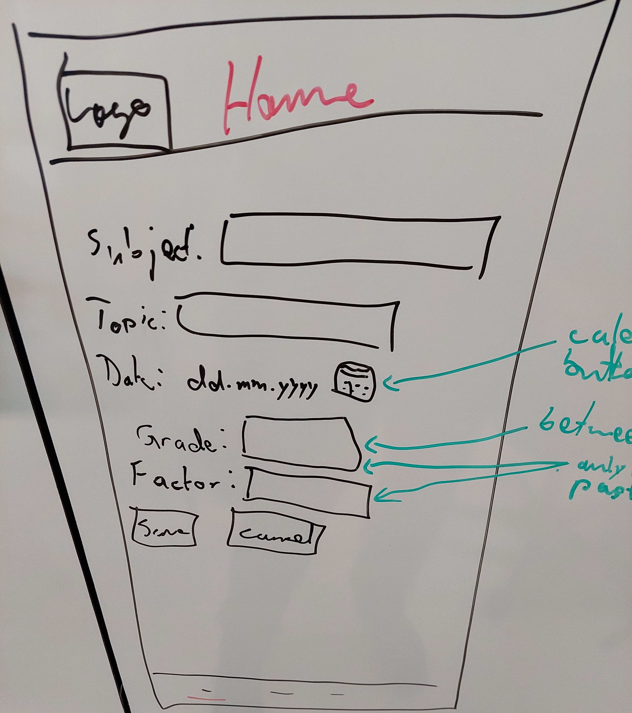
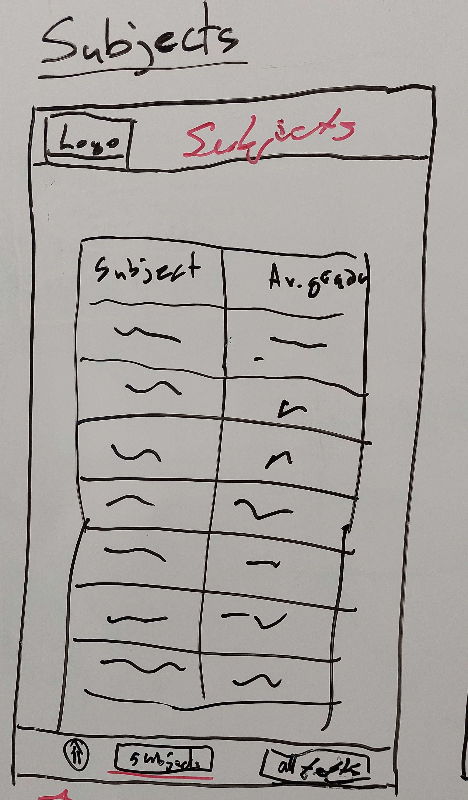
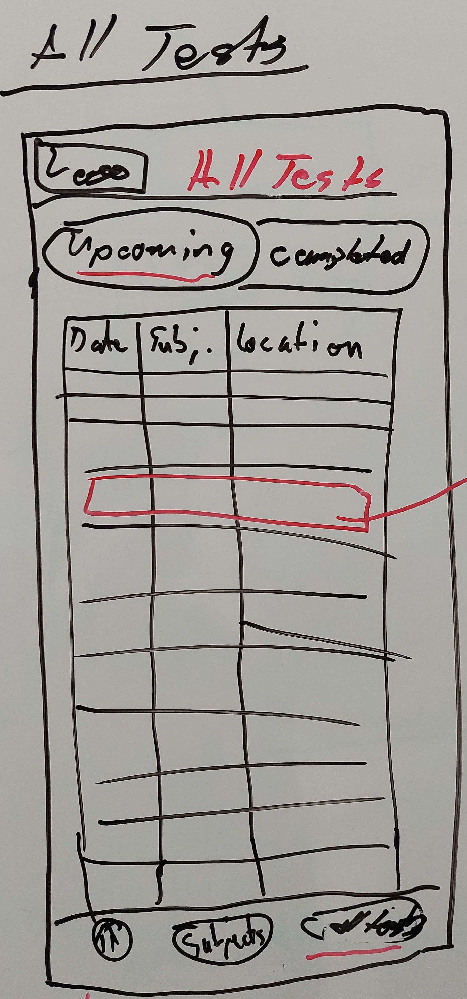
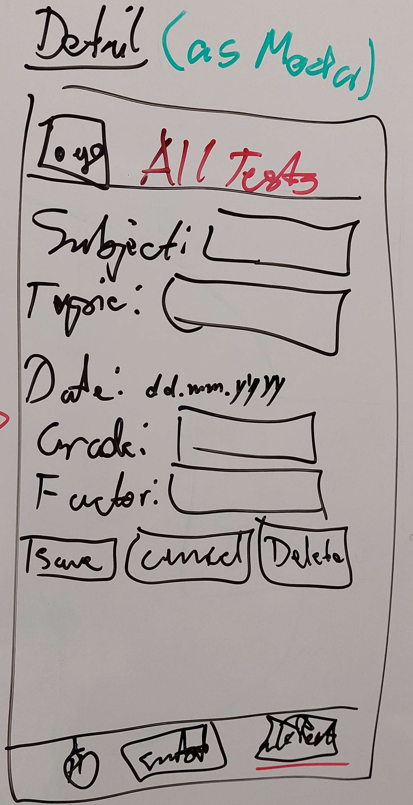

:::note
This is the documentation of the project. It has been implemented using IPERKA. It documents the process and approach of the entire project.

In this project, we are creating a small React Native multiplatform app. StudyStats allows users to track and manage their grades to have an overview of their academic performance. Our focus is on working with React Native.

:::

## Inform

This section of the documentation captures the phase in which we gather all necessary information. This includes requirements and the listing of [**all used sources**](#sources).

### Understanding React Native

React Native is an open-source framework that enables developers to create mobile applications for iOS and Android using JavaScript and React. React Native uses the same React syntax used for web applications to build user interfaces. The significant advantage is that developers can write cross-platform mobile apps with React Native, sharing the majority of the code between different platforms.

### Our Goal

The goal of this project is to develop a simple, functional grade management app. Our focus is on creating a **multiplatform** app.

This project aims to deepen our knowledge in Module 335: Mobile Application Realization and prepare for the upcoming evaluation.

### Requirements

The following table outlines the requirements for the project.

| Req. No. | Mandatory/Optional | Func./Qual./Margin. | Requirement                                                                             |
| -------- | ------------------ | ------------------- | --------------------------------------------------------------------------------------- |
| 1        | Mandatory          | Functional          | The app must run on multiple platforms (React Native and TS).                           |
| 2        | Mandatory          | Functional          | Data will be stored in the cloud.                                                       |
| 3        | Mandatory          | Functional          | Authentication will be done using MS OAuth.                                             |
| 4        | Mandatory          | Margin              | The user can log in via the UI and middleware.                                          |
| 5        | Mandatory          | Margin              | The user can create subjects via the UI.                                                |
| 6        | Mandatory          | Margin              | The user can insert grades via the UI.                                                  |
| 7        | Optional           | Margin              | The user can upload an image of their test with an upload button in the UI.             |
| 8        | Mandatory          | Margin              | A grade average will be calculated and displayed in the UI.                             |
| 9        | Mandatory          | Margin              | The UI has three fields at the bottom to switch tabs.                                   |
| 10       | Mandatory          | Margin              | The UI has a logo.                                                                      |
| 11       | Mandatory          | Margin              | The UI of the homepage displays subjects with their respective averages.                |
| 12       | Mandatory          | Margin              | The UI of the subjects page displays subjects with their respective grades and weights. |
| 13       | Mandatory          | Margin              | The UI of the subjects page allows editing subjects and grades using CRUD.              |
| 14       | Optional           | Margin              | The user can specify how grades are weighted via the UI.                                |

### Technologies

For this project, we used the following technologies:

-   [Deta Space](https://deta.space)
-   [GitHub](https://github.com)
-   [Node](https://www.npmjs.com/)
-   [MS OAuth](https://docs.microsoft.com/en-us/azure/active-directory/develop/v2-oauth2-auth-code-flow)
-   [ESLint](https://eslint.org/)
-   [Prettier](https://prettier.io/)
-   [React Native](https://reactnative.dev)

### Sources

Here are all the sources that were used as help or orientation during the project.

-   [Deta Space Dokumentation](https://deta.space/docs/en)
-   [GitHub Actions Dokumentation](https://docs.github.com/de/actions)
-   [React Native](https://reactnative.dev/docs/getting-started)

## Plan

### Work Packages

| No. | Deadline   | Description                         | Planned Time in Packages |
| --- | ---------- | :---------------------------------- | ------------------------ |
| 1   | 9.11.2023  | Setup Repository                    | 1 work package           |
| 2   | 9.11.2023  | Setup Documentation                 | 1 work package           |
| 3   | 16.11.2023 | Requirements created                | 2 work package           |
| 4   | 16.11.2023 | Technologies chosen                 | 1 work package           |
| 5   | 16.11.2023 | Setup Cloudenvironment              | 3 work package           |
| 6   | 16.11.2023 | Setup API                           | 3 work package           |
| 7   | 16.11.2023 | Docs deployed                       | 1 work package           |
| 8   | 16.11.2023 | CI/CD Setup                         | 2 work package           |
| 9   | 30.11.2023 | Updating Docs                       | 2 work package           |
| 10  | 30.11.2023 | Mockups created                     | 1 work package           |
| 11  | 30.11.2023 | Implemented auto format             | 2 work package           |
| 12  | 30.11.2023 | Planned DB-Concept                  | 1 work package           |
| 13  | 30.11.2023 | Research about OAuth                | 1 work package           |
| 14  | 7.11.2023  | Update Docs                         | 2 work package           |
| 15  | 7.11.2023  | Translated Docs German --> English  | 2 work package           |
| 16  | 14.11.2023 | Debugging Frontend                  | 2 work package           |
| 17  | 14.11.2023 | Middleware Authorization in Backend | 2 work package           |
| 18  | 21.11.2023 | Update Docs                         | 2 work package           |
| 19  | 21.11.2023 | Project Review                      | 2 work package           |
| 20  | 21.11.2023 | Writing Portfolio                   | 1 half-day               |

:::info

1x work package = 45 minutes = 1x school lesson

1x half-day = 5x work packages

:::

### Test Cases

| Test No. | Req. No. | Preconditions                                                       | Test Environment | Input/Action                                                                                                                                                                                                           | Expected Output                                                                                                                                                                                                                       |
| ------------- | ------------- | ------------------------------------------------------------------- | ---------------- | ---------------------------------------------------------------------------------------------------------------------------------------------------------------------------------------------------------------------- | ------------------------------------------------------------------------------------------------------------------------------------------------------------------------------------------------------------------------------------- |
| 1.1           | 1             | Expo app started                                                    | Expo Go          | Open the app                                                                                                                                                                                                           | The app runs as expected                                                                                                                                                                                                              |
| 1.2           | 1             | Expo app started                                                    | Google Chrome    | Open the app                                                                                                                                                                                                           | The app runs as expected                                                                                                                                                                                                              |
| 2.1           | 4             | Expo app started                                                    | Any              | Click the login button                                                                                                                                                                                                 | User gets logged in through middleware                                                                                                                                                                                                |
| 3.1           | 5, 6, 14      | User is logged in                                                   | Any              | 1. Click the "+" button on the homepage 3. Enter subject, topic and date (in the past) 5. Enter grade and factor 6. Click "Save" button                                                                 | 2. Modal "new entry" pops up 4. Field "Grade" and "Factor" and button "Image" pop up 7. The new entry is saved                                                                                                              |
| 3.2           | 5, 6, 7, 14   | User is logged in                                                   | Any              | 1. Click the "+" button on the homepage 3. Enter subject, topic and date (in the past) 5. Enter grade and factor 6. Click "image" button 8. Take a picture of the test 9. Click "Save" button | 2. Modal "new entry" pops up 4. Field "Grade" and "Factor" and button "Image" pop up 7. Camera opens 10. The new entry is saved                                                                                        |
| 3.3           | 5, 6          | User is logged in                                                   | Any              | 1. Click the "+" button on the homepage 3. Enter subject, topic and date (in the future) 4. Click "Save" button                                                                                              | 2. Modal "new entry" pops up 3. The new entry is saved as an upcoming test                                                                                                                                                       |
| 4.1           | 8             | Some tests have been saved                                          | Any              | Open the homepage                                                                                                                                                                                                      | The total grade average is being displayed at the top left                                                                                                                                                                            |
| 5.1           | 9             | User is on the homepage or the "all tests" page                     | Any              | 1. Click the "Subjects" button button                                                                                                                                                                                  | 2. The "subjects" page opens                                                                                                                                                                                                          |
| 5.2           | 9             | User is on the homepage or the "subjects" page                      | Any              | 1. Click the "All Tests" button button                                                                                                                                                                                 | 2. The "all tests" page opens                                                                                                                                                                                                         |
| 5.3           | 9             | User is on the "all tests" page or the "subjects" page              | Any              | 1. Click the "Home" button button                                                                                                                                                                                      | 2. The homepage opens                                                                                                                                                                                                                 |
| 6.1           | 10            | Expo app started                                                    | Any              | Open the homepage                                                                                                                                                                                                      | The logo is being displayed at the top left in the header                                                                                                                                                                             |
| 6.2           | 10            | Expo app started                                                    | Any              | Open the "subjects" page                                                                                                                                                                                               | The logo is being displayed at the top left in the header                                                                                                                                                                             |
| 6.3           | 10            | Expo app started                                                    | Any              | Open the "all tests" page                                                                                                                                                                                              | The logo is being displayed at the top left in the header                                                                                                                                                                             |
| 7.1           | 11            | Expo app started                                                    | Any              | Open the homepage                                                                                                                                                                                                      | The homepage displays all "subjects" with their respective averages                                                                                                                                                                   |
| 8.1           | 12            | Expo app started                                                    | Any              | Open the "subjects" page                                                                                                                                                                                               | The "subjects" page displays all subjects with their respective grades and weights                                                                                                                                                    |
| 9.1           | 13            | Some tests have been added The user is on the "all tests" page | Any              | 1. Click on one of the tests 3. Change some values 4. Click "Save"                                                                                                                                           | 2. Modal "Details" opens with the values of the test in the fields "Subject", "Topic", "Date", "Grade" and "Factor" and the buttons "Save", "Cancel" and "Delete" 5. The changed entry is saved                                  |
| 9.2           | 13            | Some tests have been added The user is on the "all tests" page | Any              | 1. Click on one of the tests 3. Click "Delete" 5. Click "Confirm"                                                                                                                                            | 2. Modal "Details" opens with the values of the test in the fields "Subject", "Topic", "Date", "Grade" and "Factor" and the buttons "Save", "Cancel" and "Delete" 4. A confirmation alert pops up 6. The entry gets deleted |

#### Test Environments

-   Visual Studio Code (VSC)
    -   Version: 1.78.2 (user setup)
    -   Commit: b3e4e68a0bc097f0ae7907b217c1119af9e03435
    -   Date: 2023-05-10T14:39:26.248Z
    -   Electron: 22.5.2
    -   Chromium: 108.0.5359.215
    -   Node.js: 16.17.1
    -   V8: 10.8.168.25-electron.0
    -   OS: Windows_NT x64 10.0.19045
    -   Sandboxed: Yes
-   Chrome (for PDFs and documentation)
    -   Version: 114.0.5735.134 (Official Build) (64-bit)

### Wireframes

These are the wireframes we came up with for the app. As they are only used for orientation when creating the frontend they are likely not going to make it into production the way they are seen here. Some minor changes and adjustments are to be expected.

#### Overview

#### Homepage

#### Subjects

#### All Tests

